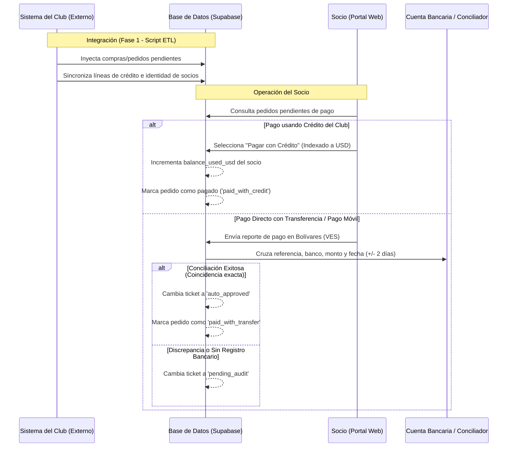

# Ecosistema FinTech — Cuenta Club Social
Este documento unifica el **Product Requirements Document (PRD)** original con las **especificaciones técnicas y flujos operativos** acordados durante la fase de diseño y brainstorm. Sirve como fuente de verdad y referencia para el desarrollo del proyecto.

---

## 1. Resumen Ejecutivo y Objetivos

*   **Producto:** Plataforma SaaS de gestión financiera, asignación de líneas de crédito y auditoría para socios y administración de un club social.
*   **Escala:** Diseñado para soportar de 2,000 a más de 8,000 usuarios activos.
*   **Objetivo Core:** Permitir el pago y amortización de deudas mediante conciliación pasiva automatizada de transferencias y Pago Móvil (Venezuela), con contingencia de auditoría manual conforme a la regulación de SUDEBAN.

---

## 2. Flujo Financiero y de Negocio

El ciclo de facturación y amortización sigue el siguiente flujo de datos:

---

## 3. Especificaciones del Motor de Conciliación y Flujos Operativos

### 3.1. Conciliación Automática e Híbrida (CSV + Mock)
*   **Origen de Datos Bancarios:** El administrador sube periódicamente extractos bancarios en formato CSV/Excel a través del panel de control. El sistema también incluye un simulador de transacciones para desarrollo y pruebas del motor.
*   **Regla de Validación:** El motor de base de datos realiza búsquedas atómicas basadas en la clave única compuesta `UNIQUE(bank_origin_code, reference_number)`. Si los montos en VES coinciden y la fecha de pago está en un rango de ±2 días, se aprueba la transacción.

### 3.2. Gestión de Errores de Reporte (Socio)
Si un socio se equivoca al reportar los datos de su transferencia (ej. escribe mal el número de referencia):
1.  **Edición en Espera:** El socio puede editar el ticket mientras este permanezca en estado `pending_audit`. Al guardar, el sistema vuelve a ejecutar la conciliación automática.
2.  **Cancelación Directa:** El socio puede cancelar el reporte erróneo, cambiando el estado del ticket a `cancelled` para poder generar un nuevo reporte con la información correcta.
3.  **Soporte WhatsApp:** Si el ticket es rechazado o continúa pendiente, el socio dispone de un botón de soporte que genera un enlace automático a WhatsApp (`https://wa.me/`) con los detalles de su transacción formateados. Esto facilita la validación manual por parte del operador de caja mediante capturas de pantalla.

### 3.3. Control de Tasa Cambiaria (Tasa BCV Híbrida)
*   **Captura:** Una Edge Function programada en Supabase lee a diario el valor oficial del Banco Central de Venezuela (BCV) y lo registra como `'proposed'`.
*   **Autorización:** La nueva tasa requiere aprobación manual del `head_admin`.
*   **Activación:** Al aprobarse, la tasa anterior pasa a `'archived'`, la nueva se marca como `'active'` y todos los nuevos cálculos financieros la aplican inmediatamente.

---

## 4. Estructura de Datos (Tablas PostgreSQL)

El sistema opera bajo precisión estricta usando el tipo `NUMERIC(15,2)` para mitigar errores de redondeo en operaciones cambiarias e indexación.

### 4.1. Tabla: `users`
*   `id` `UUID` (PK, referenciado a `auth.users` de Supabase)
*   `membership_number` `VARCHAR(50)` (Unique) - Lista cerrada inyectada de socios.
*   `identity_card` `VARCHAR(20)` (Unique) - Cédula de identidad (ej. "V-12345678").
*   `role` `VARCHAR(20)` - Roles de sistema: `'socio'`, `'auditor'`, `'head_admin'`.
*   `full_name` `VARCHAR(100)`
*   `created_at` `TIMESTAMPTZ`

### 4.2. Tabla: `credit_accounts`
*   `id` `UUID` (PK)
*   `user_id` `UUID` (FK `users.id`, Unique)
*   `credit_limit_usd` `NUMERIC(15,2)` - Límite de crédito disponible.
*   `balance_used_usd` `NUMERIC(15,2)` - Saldo deudor en dólares.
*   `updated_at` `TIMESTAMPTZ`

### 4.3. Tabla: `purchases_orders`
*   `id` `UUID` (PK)
*   `user_id` `UUID` (FK `users.id`)
*   `invoice_number` `VARCHAR(50)` (Unique) - Número del pedido importado.
*   `amount_usd` `NUMERIC(15,2)` - Monto de la compra.
*   `description` `TEXT`
*   `status` `VARCHAR(20)` - `'pending'`, `'paid_with_credit'`, `'paid_with_transfer'`.
*   `created_at` `TIMESTAMPTZ`
*   `updated_at` `TIMESTAMPTZ`

### 4.4. Tabla: `monthly_billings`
*   `id` `UUID` (PK)
*   `credit_account_id` `UUID` (FK `credit_accounts.id`)
*   `billing_period` `DATE` - Fecha del mes acumulado (ej. `'2026-05-01'`).
*   `amount_usd` `NUMERIC(15,2)` - Consumo acumulado mensual facturado.
*   `description` `TEXT`
*   `created_at` `TIMESTAMPTZ`

### 4.5. Tabla: `payment_tickets`
*   `id` `UUID` (PK)
*   `user_id` `UUID` (FK `users.id`)
*   `purchase_order_id` `UUID` (FK `purchases_orders.id`, Nullable)
*   `bank_origin_code` `VARCHAR(10)` - Código del banco (ej. "0102" para Banco de Venezuela).
*   `payment_method` `VARCHAR(20)` - `'mobile_payment'` o `'transfer'`.
*   `phone_number` `VARCHAR(20)` (Nullable) - Número del teléfono emisor.
*   `reference_number` `VARCHAR(50)`
*   `payment_date` `DATE`
*   `amount_ves` `NUMERIC(15,2)`
*   `bcv_rate_used` `NUMERIC(15,2)`
*   `amount_usd` `NUMERIC(15,2)`
*   `status` `VARCHAR(20)` - `'auto_approved'`, `'pending_audit'`, `'manually_approved'`, `'rejected'`, `'cancelled'`.
*   `rejection_reason` `TEXT` (Nullable)
*   `audited_by` `UUID` (FK `users.id`, Nullable)
*   `audited_at` `TIMESTAMPTZ` (Nullable)
*   `created_at` `TIMESTAMPTZ`
*   *Restricción:* `UNIQUE(bank_origin_code, reference_number)`

### 4.6. Tabla: `bank_transactions_mock`
*   `id` `UUID` (PK)
*   `bank_origin_code` `VARCHAR(10)`
*   `reference_number` `VARCHAR(50)`
*   `amount_ves` `NUMERIC(15,2)`
*   `payment_date` `DATE`
*   `phone_number` `VARCHAR(20)` (Nullable)
*   `identity_card` `VARCHAR(20)` (Nullable)
*   `is_reconciled` `BOOLEAN`
*   `created_at` `TIMESTAMPTZ`
*   *Restricción:* `UNIQUE(bank_origin_code, reference_number)`

### 4.7. Tabla: `exchange_rates`
*   `id` `UUID` (PK)
*   `rate` `NUMERIC(15,2)`
*   `status` `VARCHAR(20)` - `'proposed'`, `'active'`, `'archived'`.
*   `proposed_at` `TIMESTAMPTZ`
*   `activated_at` `TIMESTAMPTZ`
*   `activated_by` `UUID` (FK `users.id`, Nullable)

### 4.8. Tabla: `audit_logs`
*   `id` `UUID` (PK)
*   `actor_id` `UUID` (FK `users.id`, Nullable)
*   `action` `VARCHAR(50)`
*   `details` `JSONB`
*   `ip_address` `INET`
*   `created_at` `TIMESTAMPTZ`

---

## 5. Control de Roles y Políticas RLS

La segregación de permisos se ejecuta en base de datos mediante PostgreSQL Row Level Security (RLS), cumpliendo con los estándares de control interno:

1.  **Socio (User):** Únicamente visualiza y edita su propia información, sus saldos, pedidos pendientes y tickets de pago generados por él. Tiene bloqueado el acceso a los registros de auditoría y transacciones bancarias directas del club.
2.  **Auditor (Staff Admin):** Visualiza los reportes e historiales de los socios para gestionar las aprobaciones de la cola de pagos. No tiene acceso a la visualización de la bitácora global de auditoría (`audit_logs`) para asegurar la separación de deberes.
3.  **Head Admin (SuperAdmin):** Posee permisos globales de lectura, escritura y modificación. Tiene acceso de lectura exclusivo a la tabla `audit_logs` para control forense y es el único rol autorizado a activar las propuestas de tasas cambiarias.

---

## 6. Cumplimiento de Normativa de Seguridad (SUDEBAN)

Para cumplir con la regulación FinTech de SUDEBAN en Venezuela:
*   **Bitácora Inalterable:** La tabla `audit_logs` carece de permisos de `UPDATE` y `DELETE` para cualquier usuario del sistema, garantizando la integridad histórica de los registros.
*   **Registro de IP:** El sistema captura y almacena la dirección IP y marca temporal de los administradores y socios al realizar operaciones que involucren cambios en el estado de cuentas o aprobaciones de pago.
