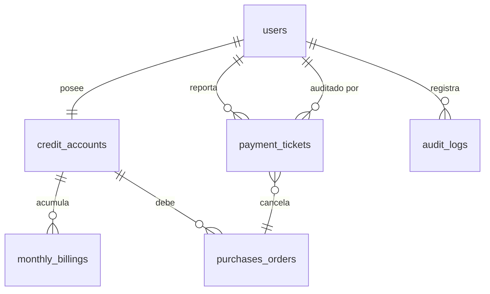

# Especificación de Diseño: Ecosistema FinTech — Cuenta Club Social
**Fecha:** 2026-05-23
**Estado:** Propuesto (Para revisión de usuario)
**Autor:** Antigravity (AI Pair Programmer)

---

## 1. Introducción y Contexto

Este documento define la arquitectura técnica para la Fase 1 (MVP) de la plataforma de gestión financiera y conciliación de la Cuenta Club Social. El sistema atiende a una escala de 2,000 a 8,000 socios activos. Integra el control de límites de crédito, el registro de deudas y la validación automatizada de reportes de pago móvil y transferencias bancarias en Bolívares (VES), indexando las operaciones a la tasa del Banco Central de Venezuela (BCV).

---

## 2. Arquitectura del Sistema y Tecnologías

El sistema utiliza una arquitectura serverless desacoplada:

*   **Frontend:** Aplicación de una sola página (SPA) en React.js (Vite) desplegada en Vercel.
*   **Backend y Base de Datos:** Supabase (PostgreSQL). Utiliza Row Level Security (RLS) para proteger los datos en el motor de base de datos.
*   **Servicios Externos:**
    *   **WhatsApp Web Link:** Enlace dinámico para soporte técnico directo de tickets con discrepancias.
    *   **Sincronizador Externo (ETL):** Script programado para inyectar saldos, consumos y usuarios desde el sistema actual del cliente.

---

## 3. Modelo de Datos (Esquema PostgreSQL)

El sistema utiliza precisión decimal estricta (`NUMERIC(15,2)`) para evitar discrepancias de redondeo en transacciones financieras.



### 3.1. Tabla: `users`
Almacena la identidad y roles del sistema. Mapea directamente con la autenticación de Supabase (`auth.users`).
*   `id` `UUID` (PK, `REFERENCES auth.users`)
*   `membership_number` `VARCHAR(50)` (Unique) - Número de membresía del club.
*   `identity_card` `VARCHAR(20)` (Unique) - Cédula del socio (ej. "V-12345678").
*   `role` `VARCHAR(20)` - Permisos de acceso: `'socio'`, `'auditor'`, `'head_admin'`.
*   `full_name` `VARCHAR(100)` - Nombre completo.
*   `created_at` `TIMESTAMPTZ` (Default `now()`)

### 3.2. Tabla: `credit_accounts`
Maneja la línea de crédito autorizada en dólares y la deuda acumulada.
*   `id` `UUID` (PK, Default `gen_random_uuid()`)
*   `user_id` `UUID` (FK `users.id`, Unique)
*   `credit_limit_usd` `NUMERIC(15,2)` (Default `0.00`) - Límite de crédito.
*   `balance_used_usd` `NUMERIC(15,2)` (Default `0.00`) - Saldo consumido/deudor.
*   `updated_at` `TIMESTAMPTZ` (Default `now()`)

### 3.3. Tabla: `purchases_orders`
Pedidos o consumos individuales inyectados desde el sistema del club.
*   `id` `UUID` (PK, Default `gen_random_uuid()`)
*   `user_id` `UUID` (FK `users.id`)
*   `invoice_number` `VARCHAR(50)` (Unique) - Código del pedido del sistema del club.
*   `amount_usd` `NUMERIC(15,2)` - Monto de la compra.
*   `description` `TEXT` - Detalle del consumo.
*   `status` `VARCHAR(20)` - Estados: `'pending'` (pendiente), `'paid_with_credit'` (pagado con crédito del club), `'paid_with_transfer'` (pagado directamente por banco).
*   `created_at` `TIMESTAMPTZ`
*   `updated_at` `TIMESTAMPTZ` (Default `now()`)

### 3.4. Tabla: `monthly_billings`
Trazabilidad de cargos acumulados mes a mes para visualización agregada por cuenta.
*   `id` `UUID` (PK, Default `gen_random_uuid()`)
*   `credit_account_id` `UUID` (FK `credit_accounts.id`)
*   `billing_period` `DATE` - Primer día del mes facturado (ej. `'2026-05-01'`).
*   `amount_usd` `NUMERIC(15,2)` - Monto total de cargos facturados en el periodo.
*   `description` `TEXT` - Descripción del periodo.
*   `created_at` `TIMESTAMPTZ` (Default `now()`)

### 3.5. Tabla: `payment_tickets`
Registro de reportes de pago hechos por los socios.
*   `id` `UUID` (PK, Default `gen_random_uuid()`)
*   `user_id` `UUID` (FK `users.id`)
*   `purchase_order_id` `UUID` (FK `purchases_orders.id`, Nullable) - Asignado si paga un pedido directamente.
*   `bank_origin_code` `VARCHAR(10)` - Código bancario emisor (ej. "0102").
*   `payment_method` `VARCHAR(20)` - `'mobile_payment'` o `'transfer'`.
*   `phone_number` `VARCHAR(20)` (Nullable) - Teléfono origen si es pago móvil.
*   `reference_number` `VARCHAR(50)` - Número de referencia bancario.
*   `payment_date` `DATE` - Fecha en la que se efectuó el pago.
*   `amount_ves` `NUMERIC(15,2)` - Monto transferido en Bolívares.
*   `bcv_rate_used` `NUMERIC(15,2)` - Tasa BCV aplicada.
*   `amount_usd` `NUMERIC(15,2)` - Equivalente en USD (`amount_ves` / `bcv_rate_used`).
*   `status` `VARCHAR(20)` - Estados: `'auto_approved'`, `'pending_audit'`, `'manually_approved'`, `'rejected'`, `'cancelled'`.
*   `rejection_reason` `TEXT` (Nullable) - Razón de rechazo del auditor.
*   `audited_by` `UUID` (FK `users.id`, Nullable) - Auditor que procesó el caso.
*   `audited_at` `TIMESTAMPTZ` (Nullable)
*   `created_at` `TIMESTAMPTZ` (Default `now()`)
*   *Restricción:* `UNIQUE(bank_origin_code, reference_number)` - Bloquea registros duplicados.

### 3.6. Tabla: `bank_transactions_mock`
Historial de transacciones de la cuenta bancaria del club, importadas vía CSV o generadas por el simulador de pruebas.
*   `id` `UUID` (PK, Default `gen_random_uuid()`)
*   `bank_origin_code` `VARCHAR(10)`
*   `reference_number` `VARCHAR(50)`
*   `amount_ves` `NUMERIC(15,2)`
*   `payment_date` `DATE`
*   `phone_number` `VARCHAR(20)` (Nullable)
*   `identity_card` `VARCHAR(20)` (Nullable)
*   `is_reconciled` `BOOLEAN` (Default `false`)
*   `created_at` `TIMESTAMPTZ` (Default `now()`)
*   *Restricción:* `UNIQUE(bank_origin_code, reference_number)`

### 3.7. Tabla: `exchange_rates`
Control de tasas cambiarias bajo esquema de aprobación del administrador.
*   `id` `UUID` (PK, Default `gen_random_uuid()`)
*   `rate` `NUMERIC(15,2)` - Tasa VES/USD.
*   `status` `VARCHAR(20)` - Estados: `'proposed'` (propuesta automática), `'active'` (tasa vigente), `'archived'` (histórica).
*   `proposed_at` `TIMESTAMPTZ` (Default `now()`)
*   `activated_at` `TIMESTAMPTZ` (Nullable)
*   `activated_by` `UUID` (FK `users.id`, Nullable)

### 3.8. Tabla: `audit_logs`
Bitácora inmutable de auditoría para cumplimiento de normativas SUDEBAN. No admite `UPDATE` ni `DELETE`.
*   `id` `UUID` (PK, Default `gen_random_uuid()`)
*   `actor_id` `UUID` (FK `users.id`, Nullable) - Persona que ejecuta la acción.
*   `action` `VARCHAR(50)` - Acción registrada (ej. `'approve_ticket_manual'`, `'change_credit_limit'`, `'activate_rate'`).
*   `details` `JSONB` - Valores anteriores y nuevos.
*   `ip_address` `INET` - Dirección IP del cliente.
*   `created_at` `TIMESTAMPTZ` (Default `now()`)

---

## 4. Control de Accesos y Seguridad (RBAC y RLS)

La seguridad se define en la base de datos a través de políticas Row Level Security (RLS) en Supabase:

| Tabla | Socio (`role = 'socio'`) | Staff Admin (`role = 'auditor'`) | Head Admin (`role = 'head_admin'`) |
| :--- | :--- | :--- | :--- |
| `users` | Leer propia fila | Leer todos | Todos los permisos |
| `credit_accounts` | Leer propia fila | Leer todos | Todos los permisos |
| `purchases_orders` | Leer propios registros | Leer todos | Todos los permisos |
| `payment_tickets` | Leer y Crear propios (No editar/borrar) | Leer todos, Modificar estado | Todos los permisos |
| `bank_transactions_mock` | Sin acceso | Leer y Cargar CSV | Todos los permisos |
| `exchange_rates` | Leer tasa activa | Leer todas | Todos los permisos |
| `audit_logs` | Sin acceso | Sin acceso | Leer (Exclusivo Head Admin) |

---

## 5. Lógica del Motor de Conciliación

El proceso de conciliación se ejecuta de la siguiente forma al insertar un reporte en `payment_tickets`:

```
[Socio envía ticket]
        |
        v
[Buscar en bank_transactions_mock coincidencia de bank_origin_code + reference_number]
        |
        +---> SI: [¿Coincide monto y la fecha está dentro de +/- 2 días?]
        |            |
        |            +---> SI: [Cambiar estado a 'auto_approved']
        |            |         [Marcar transacción bancaria como reconciled = true]
        |            |         [Actualizar saldo de la deuda/pedido correspondiente]
        |            |
        |            +---> NO: [Cambiar estado a 'pending_audit']
        |
        +---> NO: [Cambiar estado a 'pending_audit']
```

### 5.1. Manejo de Errores y Corrección del Socio
1.  **Edición de ticket pendiente:** Si el ticket está en estado `pending_audit`, el socio puede corregir los campos (referencia, banco, monto). El guardado de cambios reejecuta la conciliación automática.
2.  **Cancelación del ticket:** El socio puede cancelar el reporte si se equivocó de forma irremediable. Esto cambia el estado a `'cancelled'` y libera el pedido para ser reportado con otra referencia.
3.  **Acción del Auditor:** El auditor puede corregir el número de referencia directamente desde su panel si detecta un error de transcripción leve (ej. falta un dígito verificado visualmente en el extracto bancario) y aprobar el pago de forma manual. Esto escribe un registro obligatorio en `audit_logs`.

---

## 6. Integración de Soporte por WhatsApp

Cuando un ticket cambia a `pending_audit` o `rejected`, la interfaz del socio habilita un botón para contactar a soporte técnico. El botón redirige a:

`https://wa.me/{TELEFONO_SOPORTE}?text={MENSAJE_CODIFICADO}`

El mensaje codificado contiene el siguiente formato estructurado:
```text
Hola, necesito soporte con mi reporte de pago. Aquí están los detalles:

👤 Socio: {full_name}
🆔 Cédula: {identity_card}
💳 Membresía: {membership_number}
🏦 Banco Origen: {bank_origin_code}
🔢 Referencia: {reference_number}
💵 Monto: {amount_ves} VES ({amount_usd} USD)
📅 Fecha de Pago: {payment_date}
⚠️ Estado en Sistema: {status}
```

---

## 7. Flujo de Tasa BCV Híbrida

1.  **Scraping:** Una Edge Function consulta diariamente la tasa del BCV e inserta el valor con el estado `'proposed'`.
2.  **Autorización:** La tasa de cambio no entra en vigor hasta que el `head_admin` autorice la propuesta desde el panel administrativo.
3.  **Transición:** La aprobación archiva la tasa `'active'` anterior y establece la nueva como `'active'`. Los nuevos cálculos de deudas y tickets toman la tasa activa al instante.
