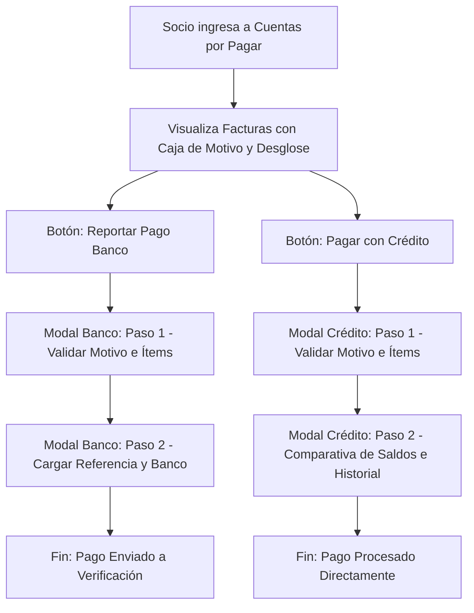

# Especificación de Diseño: Flujo de Cuentas por Pagar y Motivo de Facturación

Este documento detalla el diseño de interfaz y el flujo de usuario para mostrar facturas pendientes en el portal del socio, incorporando de manera explícita la trazabilidad y la justificación de cada cargo ("el por qué se factura") en todo el proceso de reporte de pago.

## 1. Objetivos del Diseño

* **Transparencia:** Permitir al socio entender con precisión qué se le está cobrando y por qué, previo a iniciar cualquier proceso de pago.
* **Consistencia Visual:** Mantener un componente unificado para el "Motivo del Cargo" en la vista principal (`CuentasView`) y en los pasos iniciales de los modales de pago (`PaymentModal` y `CreditPaymentModal`).
* **Estética Premium:** Utilizar el sistema de diseño existente (estilo glassmorphism con acentos dorados) para destacar la información clave sin sobrecargar la interfaz.

---

## 2. Detalles de Interfaz de Usuario (UI)

### 2.1. Tarjeta de Factura en CuentasView
En la lista de facturas pendientes, cada tarjeta (`.bill-card`) incorporará una caja de motivo justo después de la cabecera:

```html
<div class="bill-reason-box">
  <span class="reason-label">Motivo de Facturación / Concepto</span>
  <strong class="reason-text">{bill.description}</strong>
</div>
```

* **Estilos CSS Asociados:**
  * Fondo: `rgba(197, 168, 128, 0.08)` (tonalidad dorada muy suave y translúcida).
  * Borde: `border-left: 3px solid var(--color-accent)` (dorado de acento para captar la atención de forma sutil).
  * Bordes redondeados y padding: `border-radius: 0 8px 8px 0`, `padding: 0.8rem 1rem`.
  * Tipografía: Etiqueta en tamaño pequeño (`0.75rem`), mayúsculas y color secundario; el texto del motivo en tamaño mediano (`1.05rem`) en negrita y color principal.

### 2.2. Modal de Reporte de Pago Bancario (`PaymentModal.jsx`)
* **Paso 1 (Detalles de Facturación):** Mostrar la caja `.bill-reason-box` encima de la tabla detallada de ítems.
* El usuario revisará el concepto general ("por qué se factura") y la lista detallada de consumos con sus subtotales en USD y VES antes de proceder al Paso 2 (formulario de reporte).

### 2.3. Modal de Pago con Crédito (`CreditPaymentModal.jsx`)
* **Paso 1 (Detalles de Facturación):** Incorporar exactamente el mismo componente visual `.bill-reason-box` por encima de la tabla.
* Esto equipara el flujo de pago con crédito al flujo de reporte bancario, asegurando que el socio comprenda los cargos antes de comprometer su saldo deudor.

---

## 3. Flujo de Usuario (UX)



---

## 4. Plan de Verificación

### Pruebas de Renderizado y Flujo:
1. **Verificar listado:** Comprobar que en `CuentasView.jsx` cada factura pendiente muestre correctamente su caja de motivo (`bill.description`).
2. **Flujo de Pago Banco:** Abrir una factura, verificar que el Paso 1 muestre el motivo, presionar "Continuar a Pago", rellenar los datos de reporte y enviar.
3. **Flujo de Pago Crédito:** Abrir una factura, verificar que el Paso 1 muestre el motivo, presionar "Continuar" y verificar el Paso 2 de confirmación de saldo.
4. **Pruebas unitarias:** Ejecutar la suite de pruebas de Vitest para comprobar que no existan regresiones en `CuentasView.test.jsx`, `PaymentModal.test.jsx` o `CreditPaymentModal.test.jsx`.
