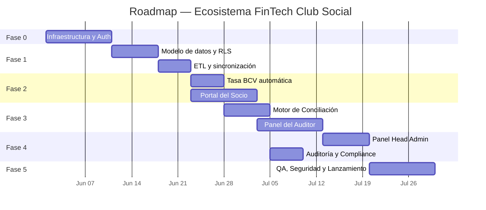

# Roadmap de Desarrollo: Ecosistema FinTech — Cuenta Club Social

**Fecha:** 2026-05-23
**Versión:** 1.0
**Documento de diseño:** [ecosistema-fintech-club-design.md](./2026-05-23-ecosistema-fintech-club-design.md)
**Investigación técnica:** [investigacion-funciones-tecnicas.md](./2026-05-23-investigacion-funciones-tecnicas.md)

---

## Resumen Ejecutivo

Este roadmap define **5 fases de desarrollo** que llevan el sistema desde la infraestructura base hasta una plataforma fintech operativa con conciliación automatizada, tasa BCV en tiempo real y panel de auditoría. Cada fase tiene entregables verificables, dependencias claras y criterios de aceptación.

---

## Fase 0 — Infraestructura y Autenticación
**Duración estimada:** 10 días
**Objetivo:** Establecer el proyecto base, configurar las herramientas de desarrollo y el sistema de autenticación.

### Entregables

| # | Entregable | Descripción |
|:---|:---|:---|
| 0.1 | Proyecto React + Vite | Scaffolding del proyecto con estructura de carpetas, ESLint, Prettier |
| 0.2 | Proyecto Supabase | Crear proyecto en Supabase, configurar variables de entorno |
| 0.3 | Autenticación | Login/Logout con Supabase Auth (email + contraseña) |
| 0.4 | Protección de rutas | Middleware de React Router que verifica sesión activa y rol del usuario |
| 0.5 | Layout base | Shell de la aplicación con navegación condicional por rol |
| 0.6 | Repositorio Git | Repositorio inicializado con `.gitignore`, ramas `main` y `develop` |
| 0.7 | Deploy inicial | Vercel conectado al repositorio con preview en cada PR |

### Criterios de Aceptación
- [ ] Un usuario puede registrarse, iniciar sesión y cerrar sesión
- [ ] Las rutas protegidas redirigen a login si no hay sesión
- [ ] El deploy en Vercel muestra la app funcionando con login

### Dependencias
- Cuenta de Supabase activa (plan gratuito suficiente para MVP)
- Cuenta de Vercel
- Dominio configurado (opcional para MVP)

---

## Fase 1 — Modelo de Datos, RLS y ETL
**Duración estimada:** 12 días
**Objetivo:** Crear toda la estructura de base de datos, configurar la seguridad a nivel de fila y establecer el pipeline de sincronización con el sistema del club.

### Entregables

| # | Entregable | Descripción |
|:---|:---|:---|
| 1.1 | Migración SQL completa | Crear las 8 tablas del esquema: `users`, `credit_accounts`, `purchases_orders`, `monthly_billings`, `payment_tickets`, `bank_transactions_mock`, `exchange_rates`, `audit_logs` |
| 1.2 | Políticas RLS | Implementar todas las políticas de seguridad según la matriz de accesos del spec (Sección 4) |
| 1.3 | Triggers de auditoría | Trigger PL/pgSQL que inserta en `audit_logs` cada operación financiera relevante |
| 1.4 | Seed data | Datos de prueba: 50 usuarios, 3 roles, 200 consumos, 5 tasas BCV históricas |
| 1.5 | Script ETL | Edge Function o script Node.js que procesa CSV del sistema del club e inserta/actualiza usuarios, cuentas de crédito y pedidos |
| 1.6 | Documentación ETL | Formato esperado del CSV, mapeo de campos, manejo de errores |

### Criterios de Aceptación
- [ ] Las tablas se crean correctamente vía migración SQL
- [ ] Un usuario con rol `socio` solo puede ver sus propios datos (verificar con test RLS)
- [ ] Un usuario con rol `auditor` puede ver todos los tickets pero no puede ver `audit_logs`
- [ ] El script ETL procesa un CSV de 1,000 filas sin errores y actualiza las tablas correctas
- [ ] Las operaciones ETL generan registros en `audit_logs`

### Dependencias
- Fase 0 completada
- Archivo CSV de ejemplo del sistema del club (proporcionado por el cliente)

---

## Fase 2 — Tasa BCV y Portal del Socio
**Duración estimada:** 15 días (en paralelo)
**Objetivo:** Implementar la obtención automática de la tasa del BCV y construir la interfaz principal para los socios.

### 2A. Tasa BCV Automática (5 días)

| # | Entregable | Descripción |
|:---|:---|:---|
| 2A.1 | Edge Function `fetch-bcv-rate` | Función Deno que consulta DolarApi.com con fallback a scraping del BCV |
| 2A.2 | Cron job `pg_cron` | Tarea programada diaria (9:00 AM VET) que invoca la Edge Function |
| 2A.3 | Lógica de fallback | Si DolarApi falla → scraping BCV. Si ambos fallan → mantener tasa anterior y registrar error |
| 2A.4 | Panel de aprobación de tasa | Vista para `head_admin`: ver tasa propuesta, aprobar, ver historial |

**Criterios de Aceptación — 2A:**
- [ ] La Edge Function devuelve la tasa correcta del día al invocarla manualmente
- [ ] El cron job se ejecuta a la hora configurada (verificar en `cron.job_run_details`)
- [ ] La tasa propuesta aparece en el panel del admin con botón "Aprobar"
- [ ] Al aprobar, la tasa anterior pasa a `'archived'` y la nueva a `'active'`
- [ ] Si ambas fuentes fallan, el sistema sigue operando con la última tasa activa

### 2B. Portal del Socio (10 días)

| # | Entregable | Descripción |
|:---|:---|:---|
| 2B.1 | Dashboard del socio | Vista principal: saldo de deuda, límite de crédito, tasa BCV vigente |
| 2B.2 | Lista de pedidos/consumos | Tabla con pedidos del socio, estado de pago, monto en USD y VES |
| 2B.3 | Formulario de reporte de pago | Formulario para reportar pago móvil/transferencia: banco, referencia, monto, fecha |
| 2B.4 | Historial de tickets | Lista de reportes del socio con estado actual de cada uno |
| 2B.5 | Edición de ticket pendiente | Permitir corregir campos si el ticket está en `pending_audit` |
| 2B.6 | Cancelación de ticket | Botón para cancelar un reporte erróneo |
| 2B.7 | Botón de soporte WhatsApp | Enlace `wa.me` con mensaje pre-rellenado cuando el ticket está pendiente o rechazado |

**Criterios de Aceptación — 2B:**
- [ ] El socio ve su deuda en USD y el equivalente en VES con la tasa vigente
- [ ] El formulario de reporte calcula `amount_usd` automáticamente al ingresar VES y usar la tasa activa
- [ ] No se puede reportar un pago con un banco o referencia duplicados (validación frontend + constraint DB)
- [ ] El botón de WhatsApp abre el chat con el mensaje correcto pre-rellenado
- [ ] Un ticket cancelado libera el pedido para ser reportado nuevamente

### Dependencias
- Fase 1 completada
- Número de teléfono de soporte WhatsApp (proporcionado por el cliente)
- Confirmación del banco receptor del club (para códigos bancarios)

---

## Fase 3 — Motor de Conciliación y Panel del Auditor
**Duración estimada:** 17 días (en paralelo)
**Objetivo:** Implementar la lógica de cruce automático entre tickets y transacciones bancarias, y el panel para que los auditores gestionen discrepancias.

### 3A. Motor de Conciliación (7 días)

| # | Entregable | Descripción |
|:---|:---|:---|
| 3A.1 | Trigger de conciliación | Trigger PL/pgSQL en `payment_tickets` que ejecuta el cruce al insertar o actualizar un ticket |
| 3A.2 | Función de cruce | Función SQL que busca coincidencia en `bank_transactions_mock` por `bank_origin_code` + `reference_number` + `amount_ves` (tolerancia ±0.50 VES) + fecha (±2 días) |
| 3A.3 | Auto-aprobación | Si coincide: `status → 'auto_approved'`, `is_reconciled → true`, actualización del saldo en `credit_accounts` |
| 3A.4 | Derivación a auditoría | Si no coincide: `status → 'pending_audit'` |
| 3A.5 | Detección de duplicados | Rechazar automáticamente tickets con `reference_number` ya utilizada |

**Criterios de Aceptación — 3A:**
- [ ] Un ticket con datos correctos que coinciden con un registro bancario se aprueba automáticamente
- [ ] El saldo de la cuenta de crédito se reduce correctamente tras la aprobación
- [ ] Un ticket con referencia incorrecta queda en `pending_audit`
- [ ] Un ticket con referencia duplicada se rechaza con razón `referencia_duplicada`
- [ ] La re-edición de un ticket pendiente reejecuta la conciliación

### 3B. Panel del Auditor (10 días)

| # | Entregable | Descripción |
|:---|:---|:---|
| 3B.1 | Vista de tickets pendientes | Lista filtrable de todos los tickets en `pending_audit` |
| 3B.2 | Detalle de ticket | Vista con toda la información del ticket, el pedido asociado, los datos del socio y la transacción bancaria más cercana (si existe coincidencia parcial) |
| 3B.3 | Aprobación manual | Botón para aprobar un ticket manualmente con comentario obligatorio |
| 3B.4 | Rechazo con razón | Botón para rechazar con campo de texto obligatorio para la razón |
| 3B.5 | Corrección de referencia | Edición del `reference_number` por parte del auditor (re-ejecuta conciliación) |
| 3B.6 | Carga de extracto bancario | Interfaz para subir CSV del extracto bancario del club |
| 3B.7 | Historial de extractos cargados | Lista de archivos CSV subidos con fecha, cantidad de registros y estado |

**Criterios de Aceptación — 3B:**
- [ ] El auditor ve solo los tickets pendientes al entrar al panel
- [ ] La aprobación manual genera un registro obligatorio en `audit_logs`
- [ ] El rechazo notifica al socio (ticket cambia de estado) y habilita el botón de WhatsApp
- [ ] La carga de CSV inserta los registros en `bank_transactions_mock` y dispara una re-conciliación de tickets pendientes
- [ ] La corrección de referencia por parte del auditor reejecuta la conciliación y puede auto-aprobar el ticket

### Dependencias
- Fase 2 completada
- Extracto bancario de prueba del club (archivo CSV real o simulado)

---

## Fase 4 — Panel Head Admin y Auditoría
**Duración estimada:** 12 días
**Objetivo:** Construir el panel de administración avanzada y las herramientas de compliance.

### Entregables

| # | Entregable | Descripción |
|:---|:---|:---|
| 4.1 | Dashboard administrativo | Métricas: total de deuda, pagos del mes, tickets pendientes, tasa vigente |
| 4.2 | Gestión de usuarios | CRUD de socios, auditores y administradores. Cambio de roles |
| 4.3 | Gestión de límites de crédito | Modificar `credit_limit_usd` de cualquier cuenta. Registro en `audit_logs` |
| 4.4 | Visor de `audit_logs` | Tabla con búsqueda por actor, acción, fecha. Solo accesible por `head_admin` |
| 4.5 | Exportación de reportes | Exportar tickets, deudas, pagos y logs en CSV para contabilidad externa |
| 4.6 | Gestión de tasas BCV | Vista completa: propuestas, activa, historial. Botón de aprobar propuesta |
| 4.7 | Panel de extractos bancarios | Visibilidad de todos los extractos cargados, registros sin conciliar |

### Criterios de Aceptación
- [ ] Solo el `head_admin` puede acceder a `audit_logs` (verificar con otros roles)
- [ ] Un cambio de límite de crédito genera un registro en `audit_logs` con valores anteriores y nuevos
- [ ] La exportación CSV de deudas refleja los datos actuales sin discrepancias
- [ ] El dashboard muestra métricas en tiempo real (o con un delay máximo de 30 segundos)

### Dependencias
- Fases 2 y 3 completadas

---

## Fase 5 — QA, Seguridad y Lanzamiento
**Duración estimada:** 10 días
**Objetivo:** Pruebas integrales, auditoría de seguridad, corrección de defectos y despliegue a producción.

### Entregables

| # | Entregable | Descripción |
|:---|:---|:---|
| 5.1 | Plan de pruebas | Casos de prueba por flujo: reporte de pago, conciliación, aprobación, rechazo, tasa BCV |
| 5.2 | Pruebas de RLS | Verificar que cada rol solo accede a lo permitido (test automatizado o manual por rol) |
| 5.3 | Pruebas de conciliación | Ejecutar 50+ escenarios de cruce: exacto, parcial, duplicado, sin coincidencia |
| 5.4 | Pruebas de carga | Simular 500+ tickets simultáneos para validar rendimiento |
| 5.5 | Auditoría de seguridad | Checklist de producción: RLS, claves, rate limiting, CORS, headers |
| 5.6 | Corrección de defectos | Sprint de bugfixes basado en hallazgos de QA |
| 5.7 | Documentación de usuario | Manual para socios, auditores y administradores |
| 5.8 | Deploy a producción | Configurar dominio final, variables de entorno de producción, DNS |
| 5.9 | Monitoreo | Configurar alertas para: Edge Function fallida, cron job fallido, errores de conciliación |

### Criterios de Aceptación
- [ ] 0 defectos críticos abiertos
- [ ] Todas las políticas RLS pasan la verificación manual
- [ ] La conciliación procesa 500 tickets en menos de 30 segundos
- [ ] El checklist de seguridad de Supabase está completado al 100%
- [ ] La documentación de usuario cubre los 3 roles

### Dependencias
- Todas las fases anteriores completadas
- Datos reales de prueba del cliente (usuarios, consumos, extracto bancario)
- Dominio de producción configurado

---

## Resumen de Fases

| Fase | Nombre | Duración | Acumulado |
|:---|:---|:---|:---|
| 0 | Infraestructura y Auth | 10 días | 10 días |
| 1 | Modelo de Datos, RLS y ETL | 12 días | 22 días |
| 2 | Tasa BCV + Portal del Socio | 15 días | 37 días |
| 3 | Motor de Conciliación + Panel Auditor | 17 días | 54 días |
| 4 | Panel Head Admin + Auditoría | 12 días | 66 días |
| 5 | QA, Seguridad y Lanzamiento | 10 días | **76 días (~3.5 meses)** |

> [!NOTE]
> Las fases 2A/2B y 3A/3B pueden ejecutarse en paralelo internamente, lo que reduce el calendario real si hay más de un desarrollador. Las estimaciones asumen un equipo de 1-2 desarrolladores trabajando a tiempo completo.

---

## Riesgos Identificados

| Riesgo | Probabilidad | Impacto | Mitigación |
|:---|:---|:---|:---|
| DolarApi o BCV cambian la estructura | Media | Alto | Fallback dual + caché de última tasa válida |
| El banco del club no provee CSV exportable | Baja | Alto | Definir formato mínimo y pedir muestra antes de Fase 3 |
| Volumen de socios supera 8,000 | Baja | Medio | Supabase escala verticalmente; evaluar plan Pro si necesario |
| Cambios regulatorios SUDEBAN | Baja | Medio | Diseño flexible de `audit_logs` con JSONB para adaptarse |
| El cliente no entrega datos de prueba a tiempo | Media | Alto | Generar seed data realista para no bloquear desarrollo |

---

## Información del Cliente Requerida Antes de Iniciar

| # | Dato necesario | Para qué fase |
|:---|:---|:---|
| 1 | Formato del CSV de exportación del sistema actual del club | Fase 1 |
| 2 | Lista de bancos receptores del club (códigos bancarios) | Fase 2 |
| 3 | Número de WhatsApp de soporte técnico | Fase 2 |
| 4 | Extracto bancario de ejemplo (CSV o Excel) | Fase 3 |
| 5 | Lista de roles y permisos confirmados | Fase 1 |
| 6 | Dominio de producción | Fase 5 |
| 7 | Credenciales de acceso al sistema del club (para ETL) | Fase 1 |
